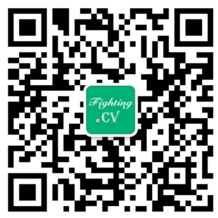

# AI/CV/DL零基础理论/实战教程汇总分享

# 【写在前面】

本文档来自于公众号【**FightingCV**】整理得到，欢迎分享给个人使用，严禁用于商业用途和行为。

为了帮助更多的同学学习深度学习相关的知识，本文档整理了深度学习的必读论文、理论推导、实战教程，更多最新科研论文解读，关注FightingCV公众号。

由于精力有限，整理的资源可能并不全面，本着“**不要偷偷内卷，大家一起进步**”的原则，欢迎大家添加小助手微信（下方二维码，添加时备注【公司/学校+方向+ID】）进行反馈和资源分享，我会及时更新这个在线文档，大家一起“**人人为我，我为人人**”，一起共同学习！

对于Attention机制感兴趣的同学，也欢迎关注我开源的Github项目：[https://github.com/xmu-xiaoma666/External-Attention-pytorch](https://github.com/xmu-xiaoma666/External-Attention-pytorch "https://github.com/xmu-xiaoma666/External-Attention-pytorch")，目前已收获了6.8K的star，欢迎大家使用\~

| FightingCV公众号 | 小助手微信 （备注【**公司/学校+方向+ID**】）|
:-------------------------:|:-------------------------:
  |   

好了，废话不多说，开始今天的分享！

# 【文字教程】

## 【550篇的人工智能核心论文】

链接：[https://pan.baidu.com/s/1EhufiGeyB3mSK0QeXI566Q](https://pan.baidu.com/s/1EhufiGeyB3mSK0QeXI566Q "https://pan.baidu.com/s/1EhufiGeyB3mSK0QeXI566Q")
提取码：kvd6

## 【整整160篇精华论文】你几乎可以在这里找到任何CV相关论文，简直太方便了！

链接：[https://pan.baidu.com/s/1ptWUjbGPfj4EmTGJAgSsJw](https://pan.baidu.com/s/1ptWUjbGPfj4EmTGJAgSsJw)
提取码：ntgg

# 【视频教程】

## Python

### **【中国科学院大学竟然把Python整理成漫画书了，漫画教学更生动，小白直接上手，拿走不谢，允许白嫖！】**

**地址：**

链接：[https://pan.baidu.com/s/1vEfmlyo3AWDX9Qjm_MzjGw](https://pan.baidu.com/s/1vEfmlyo3AWDX9Qjm_MzjGw)
提取码：87ct

**介绍：**

本套宝藏编程书籍是一本用漫面方式来给你讲技术的书籍，幽默风趣，又可看漫画又可学技术，是不是很赞，针对0基础小白和基础薄弱的伙伴学习，观看印象深刻，有利于牢记知识点。

## Pytorch

### **【PyTorch入门到实战教程！草履虫都能看懂，看不懂你打我！！！】**

**地址：**

链接：[https://pan.baidu.com/s/1bCKT9FDm0gPN8fgq3hk1MQ](https://pan.baidu.com/s/1bCKT9FDm0gPN8fgq3hk1MQ)
提取码：jydz

**介绍：**

PyTorch入门到实战教程！草履虫都能看懂，看不懂你打我！！！神经网络 人工智能 计算机视觉 深度学习 AI机器学习pytorch

## 数学基础

### **【草履虫都能学会的机器学习数学基础课程分享，中南大学博士联合南安普顿硕士打造！】**

**地址：**

链接：[https://pan.baidu.com/s/14xHITOZpNzopMtYUy80Xdw](https://pan.baidu.com/s/14xHITOZpNzopMtYUy80Xdw)
提取码：nq3i

**介绍：**

这是联合【中南大学江伟博士】【英国南安普顿大学AI硕士阿文老师】共同打造的【机器学习数学基础课程】，大家都说学习机器学习中的数学很难，所以我们用最为通俗易懂的形式给大家讲清楚了，最后几节也有教大家怎么去把数学模型应用在机器当中。

## 机器学习

### **【只需3天，带你入门机器学习！对零基础小白简直不要太友好！】**

**地址：**

链接：[https://pan.baidu.com/s/1ZBV9pv0r3SQ_i8JNtz3xDw](https://pan.baidu.com/s/1ZBV9pv0r3SQ_i8JNtz3xDw)
提取码：1fea

**介绍：**

一份对小白友好的机器学习入门教程，且是基础Python语言的，从人工智能的概念到数据挖掘到机器学习算法，还有小实战练手！非常推荐给零基础小白！

### **【**计算机博士全程手推公式+逐行代码解读带你高效啃透统计学习方法！！**】**

**地址：**

链接：[https://pan.baidu.com/s/1Y5wYgZA6Ha-646ZTVLM5Bw](https://pan.baidu.com/s/1Y5wYgZA6Ha-646ZTVLM5Bw)
提取码：xgg6

**介绍：**

给大家分享的是一位清华博士特意为苦苦啃书的伙伴们录制的一期《统计学习方法第2版》解读教程视频，全程手推公式+逐行代码解读带你高效啃书！！！

### **【**清华博士用手绘教学法把统计学习方法第2版给拆解透了！不可能还学不会！**】**

**地址：**

链接：[https://pan.baidu.com/s/15v5hjf2Qcmqplg2ixB2ENg](https://pan.baidu.com/s/15v5hjf2Qcmqplg2ixB2ENg)
提取码：308r

**介绍：**

今天给大家分享的是关于《李航·统计学习方法第2版》全套讲解视频，计算机博士用一页页手绘每个知识点的方法，带你一个知识点一个知识点啃透统计学习方法！

### **【浙大胡教授用1天就机器学习讲得连单细胞生物都能看懂！】**

**地址：**

链接：[https://pan.baidu.com/s/1k8brOGpVH-UcXtAQ-SOPQA](https://pan.baidu.com/s/1k8brOGpVH-UcXtAQ-SOPQA)
提取码：vaju

**介绍：**

小白不要再苦苦啃书了！浙江大学胡教授结合【西瓜书】【统计学习方法】把机器学习给讲得非常清晰且通俗易懂，非常推荐小白学习这门课程。

### **【**李宏毅老师2022机器学习深度学习教程**】**

**地址：**

链接：[https://pan.baidu.com/s/1pMf8lJtvasVwQKH808VDhw](https://pan.baidu.com/s/1pMf8lJtvasVwQKH808VDhw)
提取码：hku9

**介绍：**

李宏毅老师2022机器学习深度学习教程

## 深度学习

### **【我翻遍了30个网站！找到了复旦邱锡鹏神经网络与深度学习视频教程！！】**

**地址：**

链接：[https://pan.baidu.com/s/13yaVg9Qq12_ke1aILBchzQ](https://pan.baidu.com/s/13yaVg9Qq12_ke1aILBchzQ)
提取码：jwir

**介绍：**

豆瓣评分9.5!复旦大学邱锡鹏教授力作，周志华、李航联袂推荐！深受好评的深度学习讲义蒲公英书正式版！系统整理深度学习的知识体系，由浅入深地阐述深度学习的原理、模型以及方法。更适合中文读者的深度学习图书！

### **【赵博士太强了！我来首发这门复旦大学深度学习及其应用公开课，简直把深度学习全给讲透了！】**

**地址：**

链接：[https://pan.baidu.com/s/1qxjOmftzfiiwlObohhx0Mg](https://pan.baidu.com/s/1qxjOmftzfiiwlObohhx0Mg)
提取码：le10

**介绍：**

本课程主要介绍深度学习的基本原理、卷积神经网络、循环神经网络、生成对抗网络、注意力机制、Transformer等基本方法及其典型应用领域，并借助机器学习主流的开源框架实现深度学习在证券趋势预测、声音质量评价、电子推荐、目标检测、社交网络情感分析等多个典型领域的应用。

### **【深度学习保姆级教学，草履虫都能看懂！理论到实战，学不会你找我！】**

**地址：**

链接：[https://pan.baidu.com/s/1-0dRJCuPXP6WNUwpT-O6WA](https://pan.baidu.com/s/1-0dRJCuPXP6WNUwpT-O6WA)
提取码：gaf4

**介绍：**

当你和女朋友手拉手一起约会时，你可曾想，你们之间早已碰撞出了一种神秘的智慧——深度学习。
恋爱容易，相处不易，不断磨合，打造你们的默契，最终才能决定你们是否在一起。深度学习也一样，输入各种不同的参数，进行训练拟合，最后输出拟合结果。恋爱又不易，且学且珍惜！

## 计算机视觉

### **【CS231n计算机视觉公开课分享！】**

**地址：**

链接：[https://pan.baidu.com/s/1Q3eJlNzvYwOD4XHlMgQv7Q](https://pan.baidu.com/s/1Q3eJlNzvYwOD4XHlMgQv7Q)
提取码：p3ta

**介绍：**

配套中文课件+双语字幕+最新最全都给大家安排上了！

### **【计算机视觉保姆级入门教学，理论与实战相结合，造就经典！】**

**地址：**

链接：[https://pan.baidu.com/s/1KnSoGBMjB01WmrxJt2GTLQ](https://pan.baidu.com/s/1KnSoGBMjB01WmrxJt2GTLQ)
提取码：xpb8

**介绍：**

【计算机视觉保姆级入门教学】草履虫都能看懂！理论与实战相结合，造就经典！【人工智能 机器学习 深度学习 计算机视觉CV 自然语言处理NLP】

## 知识图谱

### **【膜拜！浙大大牛终于把【知识图谱】讲的如此通透，让人豁然开朗！！】**

**地址：**

链接：[https://pan.baidu.com/s/13uWxowSC-aMAHmL9Zuo08g](https://pan.baidu.com/s/13uWxowSC-aMAHmL9Zuo08g)
提取码：eybg

**介绍：**

最新最全的浙江大学陈华钧教授知识图谱课程分享。

## Transformer

### **【斯坦福新课CS25-Transformers United来啦！简直讲得太棒啦！】**

**地址：**

链接：[https://pan.baidu.com/s/1slfs5e2MAqPliY6sJ6nX9g](https://pan.baidu.com/s/1slfs5e2MAqPliY6sJ6nX9g)
提取码：5lhc

**介绍：**

这是前段时间斯坦福大学上线的一门新课程【CS25-Transformers United】，主要讲解的是Transformer在机器学习、计算机视觉、自然语言处理等多个领域中的前沿应用。

## 多模态

### **【CMU《多模态机器学习》课程by Louis-Philippe Morency】**

**地址：**

链接：[https://pan.baidu.com/s/1v0fCFw79RTq-iY7rH4SaaQ](https://pan.baidu.com/s/1v0fCFw79RTq-iY7rH4SaaQ)
提取码：y868

**介绍：**

CMU 卡内基梅隆 · 11-777 · Multimodal Machine Learning (2020) 官网：见评论区 ➤ 全套资料库：[http://blog.showmeai.tech/cmu-11-777](http://blog.showmeai.tech/cmu-11-777)

## 强化学习

### **【【莫烦Python】强化学习 Reinforcement Learning】**

**地址：**

链接：[https://pan.baidu.com/s/1cW5rzVUPoolBxIimBs_Uag](https://pan.baidu.com/s/1cW5rzVUPoolBxIimBs_Uag)
提取码：jedu

**介绍：**

强化学习是机器学习大家族中的一大类, 使用强化学习能够让机器学着如何在环境中拿到高分, 表现出优秀的成绩. Code: [https://github.com/MorvanZhou/Reinforcement-learning-with-tensorflow](https://github.com/MorvanZhou/Reinforcement-learning-with-tensorflow)

## 目标检测

### **【我愿称之为最强！室友凭借这套【深度学习目标检测】算法教程，成功拿到讯飞检测算法工程师offer！清华大佬92集带你吃透目标检测算法全系列！】**

**地址：**

链接：[https://pan.baidu.com/s/1ucxTCt8tN6smWAI5GRTwUQ](https://pan.baidu.com/s/1ucxTCt8tN6smWAI5GRTwUQ)
提取码：zlmv

**介绍：**

我愿称之为最强！室友凭借这套【深度学习目标检测】算法教程，成功拿到讯飞检测算法工程师offer！清华大佬92集带你吃透目标检测算法全系列！

## 自动驾驶

### **【自动驾驶算法工程师课程】**

**地址：**

链接：[https://pan.baidu.com/s/1aaOlGawkDMnVNYgvMNGQLQ](https://pan.baidu.com/s/1aaOlGawkDMnVNYgvMNGQLQ)
提取码：7ln8

**介绍：**

自动驾驶算法工程师课程

### **【【中文字幕】Udacity无人驾驶工程师，全站质量最高的自动驾驶课程，自动驾驶学习必看，搭配无人驾驶入门效果更佳！】**

**地址：**

链接：[https://pan.baidu.com/s/1A8tHrepHQUr2cXkd-4aq0A](https://pan.baidu.com/s/1A8tHrepHQUr2cXkd-4aq0A)
提取码：lnr4

**介绍：**

【中文字幕】Udacity无人驾驶工程师，全站质量最高的自动驾驶课程，自动驾驶学习必看，搭配无人驾驶入门效果更佳！

## OpenCV

### **【【不要再看那些过时的OpenCV老教程了】2022巨献，OpenCV零基础小白最新版全套教程(人工智能机器视觉教程)】**

**地址：**

链接：[https://pan.baidu.com/s/1zHFKGXEeSXAd91W-2jnbTQ](https://pan.baidu.com/s/1zHFKGXEeSXAd91W-2jnbTQ)
提取码：czae

**介绍：**

【不要再看那些过时的OpenCV老教程了】2022巨献，OpenCV零基础小白最新版全套教程(人工智能机器视觉教程)

## GAN

### **【最强【GAN对抗生成网络】教程，论文+原理+实战全方面解读，建议先收藏观看！】**

**地址：**

链接：[https://pan.baidu.com/s/1T8qUV2J2rG8u-oC1WnRy7w](https://pan.baidu.com/s/1T8qUV2J2rG8u-oC1WnRy7w)
提取码：qcad

**介绍：**

最强【GAN对抗生成网络】教程，论文+原理+实战全方面解读，建议先收藏观看！

## 三维重建

### **【2022最好最全的【三维重建】课程！！！北邮教授竟然把三维重建讲的如此通俗易懂，学不会退网下架！！！】**

**地址：**

链接：[https://pan.baidu.com/s/1Rn8gnGNHfKMquDb6i8UsWQ](https://pan.baidu.com/s/1Rn8gnGNHfKMquDb6i8UsWQ)
提取码：4zqk

**介绍：**

2022最好最全的【三维重建】课程！！！北邮教授竟然把三维重建讲的如此通俗易懂，学不会退网下架！！！

## 项目实战

### **【17小时我居然就学会了kaggle上最适合新手的十大项目！大佬爆肝录制机器学习算法教程（机器学习实战 深度学习实战 NLP 人脸识别 猫狗识别）】**

**地址：**

链接：[https://pan.baidu.com/s/1Nfp06qTjGGzp9IKqh9A-FA](https://pan.baidu.com/s/1Nfp06qTjGGzp9IKqh9A-FA)
提取码：tyy1

**介绍：**

适用人群
①准备毕业论文的学生
②准备跳槽，正在找工作的AI算法工程师等
③自学和准备转行到AI领域的人
④想巩固AI核心知识，查漏补缺的人

### **【Pytorch官方中文实战教程—基于Pytorch搭建聊天机器人，入门Pytorch最好的练手项目！】**

**地址：**

链接：[https://pan.baidu.com/s/1WZlP0jvz-wvzDlxRi8p3rg](https://pan.baidu.com/s/1WZlP0jvz-wvzDlxRi8p3rg)
提取码：07w7

**介绍：**

Pytorch官方中文实战教程—基于Pytorch搭建聊天机器人，入门Pytorch最好的练手项目！

### **【YOLOV5代码逐行讲解！最适合新手的【YOLOV5零基础】教程！手把手带你基于Pytorch搭建YOLOV5自己的目标检测平台】**

**地址：**

链接：[https://pan.baidu.com/s/1fxijxNk27lsj2j20eDsDaQ](https://pan.baidu.com/s/1fxijxNk27lsj2j20eDsDaQ)
提取码：l1js

**介绍：**

YOLOV5代码逐行讲解！最适合新手的【YOLOV5零基础】教程！手把手带你基于Pytorch搭建YOLOV5自己的目标检测平台

### **【最适合练手的Pytorch计算机视觉实战项目：Cifar10图像分类 COCO图像分割 Pascal VOC目标检测全详解，学完就能跑通！】**

**地址：**

链接：[https://pan.baidu.com/s/1MTn0JTAKeSMFPvxgBUO1RA](https://pan.baidu.com/s/1MTn0JTAKeSMFPvxgBUO1RA)
提取码：oy9g

**介绍：**

最适合练手的Pytorch计算机视觉实战项目：Cifar10图像分类 COCO图像分割 Pascal VOC目标检测全详解，学完就能跑通！

### **【全网最通俗易懂的深度学习项目部署实战，是个人都学会了！】**

**地址：**

链接：[https://pan.baidu.com/s/1s50yUAZF7oMqHRbRNxz0nw](https://pan.baidu.com/s/1s50yUAZF7oMqHRbRNxz0nw)
提取码：x6by

**介绍：**

全网最通俗易懂的深度学习项目部署实战，是个人都学会了！

